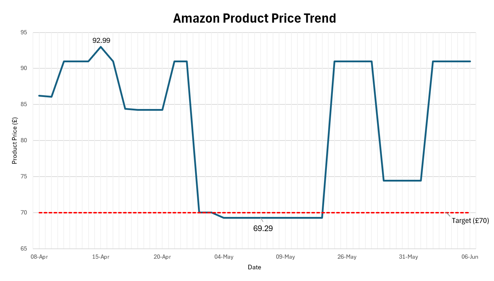

# Amazon Price Tracker

Built a Python automation script that monitors an Amazon product page, logs historical pricing data to CSV and sends an email alert when the price falls below a user-defined threshold.

## Tech Stack

* Python
* Requests
* BeautifulSoup
* SMTP Email
* CSV Files
* Windows Task Scheduler

## Workflow

```text
Amazon Product Page
        ↓
Extract Price
        ↓
Store in CSV
        ↓
Compare Against Threshold
        ↓
Send Email Alert
```

## Features

* Automated Amazon price monitoring
* Historical price logging
* Email notifications
* Scheduled daily execution via Task Scheduler
* Excel-based price trend visualisation

## Visualisation

Historical pricing data collected by the script was imported into Excel and visualised using a line chart.

The chart highlights price movements over time and identifies when the product fell below the £70 target purchase price.



## Results

| Metric                | Value    |
| --------------------- | -------- |
| Lowest Recorded Price | £69.29   |
| Potential Saving      | £21.70   |
| Historical Data       | 3 Months |
| Automated Checks      | 90+      |


## Future Improvements

* Multi-product tracking
* Database storage
* Cloud deployment as opposed to local Task Scheduler 
* Dashboard visualisation
